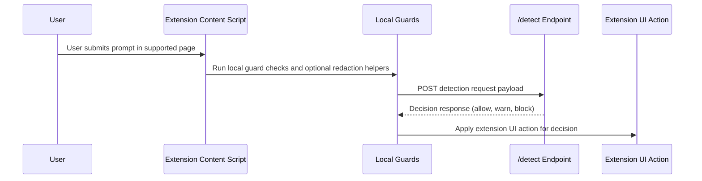

# Extension Data Flow

This document describes extension-only data flow and trust boundaries.

## Hop-By-Hop Narrative

1. The user types and submits text in a supported browser tab. The content script reads only the needed prompt field in that active interaction context.
2. Local guards run in the extension before network transfer. Guards can block unsafe local persistence and can apply optional defense-in-depth redaction helpers.
3. The extension sends a request to `/detect` with the minimum fields required for decisioning. Transport is HTTPS.
4. The `/detect` interface returns a decision (`allow`, `warn`, or `block`) and supporting metadata needed by extension UI logic.
5. The extension applies UI behavior in-page based on that decision, for example allow send-through, show warning, or stop submission.

## What Leaves The User Machine

- Prompt text submitted in the protected interaction flow.
- Minimal context fields required by the `/detect` request contract.
- Extension metadata required for policy lookup and response handling.

## What Is Stored

- The extension does not intentionally persist raw prompts in local extension storage.
- The extension stores only operational state needed for extension function, such as activation and configuration metadata.

## What Is Not Stored

- Raw prompt text in `chrome.storage.local`.
- Raw prompt text in `chrome.storage.sync`.
- Raw prompt text in `localStorage` or IndexedDB through guarded write paths.

## Data NOT In This Flow

- Browser history.
- Cookies.
- Content from unrelated tabs.
- Saved passwords.
- Full page DOM capture outside targeted input interaction.

Last reviewed: 2026-04-22
